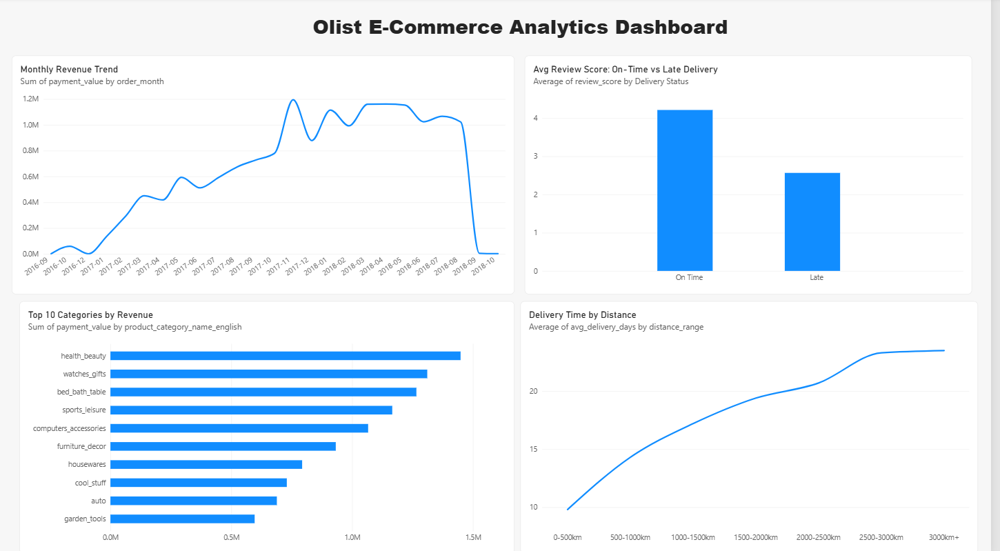
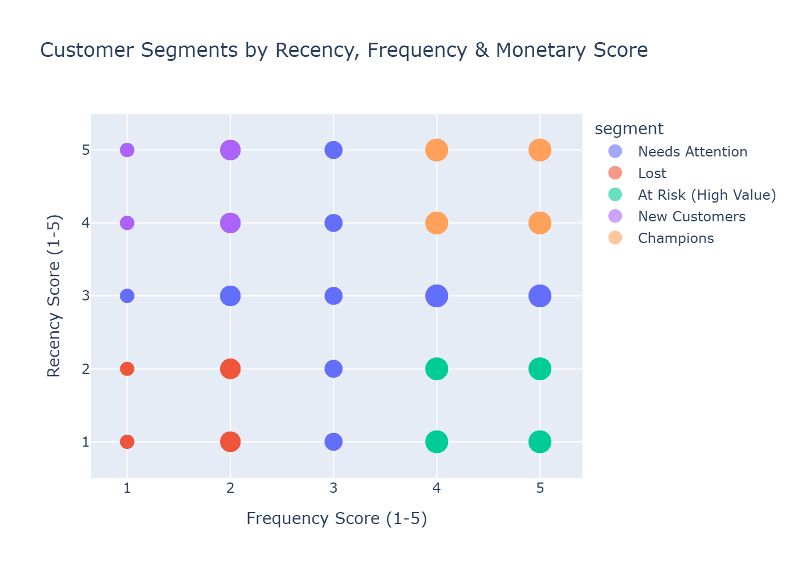
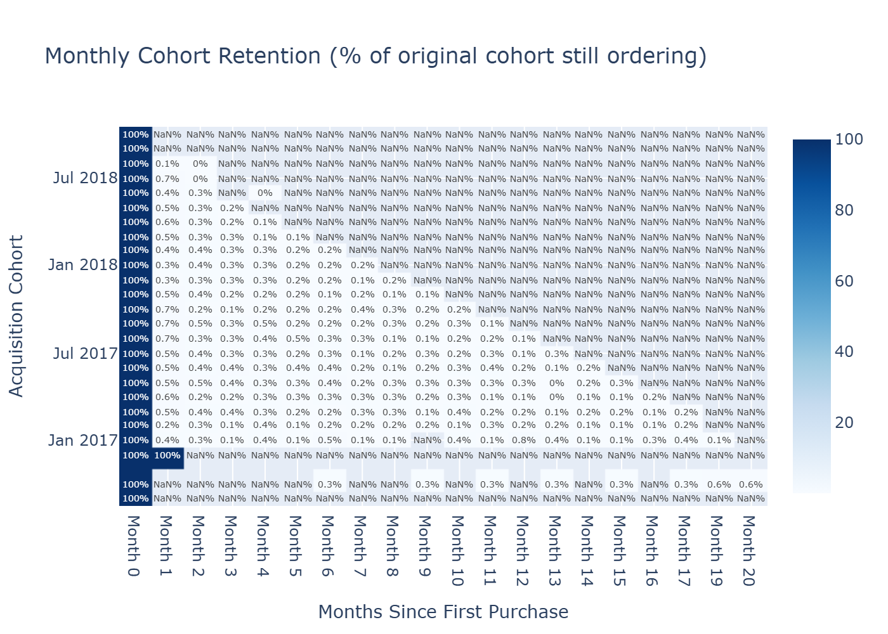

# E-Commerce Revenue, Retention & Delivery Analytics (Olist)

SQL-driven analysis of ~100K real Brazilian e-commerce orders (2016–2018), covering revenue trends, delivery performance, customer retention, and geospatial delivery logistics — built on PostgreSQL with a Power BI dashboard on top.

## Data Quality Audit

Before any analysis, I ran a structured audit against the raw tables (full detail in [`data_quality_notes.md`](./data_quality_notes.md)):

- **3%** of orders (2,965 of 99,441) are missing `order_delivered_customer_date` — excluded from delivery-time calculations rather than imputed, to avoid biasing the late-delivery findings toward an assumption.
- **2** product categories (`portateis_cozinha_e_preparadores_de_alimentos` and `pc_gamer`) had no English translation in the lookup table — grouped under `'other'` rather than dropped, so top-line revenue totals stay accurate.
- The geolocation table had up to **1,146** duplicate lat/lng rows for a single zip-code prefix, plus **42** rows with coordinates falling outside Brazil's bounding box. Resolved by averaging coordinates per prefix and excluding the out-of-bounds rows before using the table for distance calculations.

## Business Questions Answered

| # | Question | SQL |
|---|---|---|
| 1 | How is monthly revenue trending? | [`01_revenue_trends.sql`](./sql/01_revenue_trends.sql) |
| 2 | Which product categories drive the most revenue? | [`02_top_categories.sql`](./sql/02_top_categories.sql) |
| 3 | How much does late delivery hurt customer satisfaction? | [`03_delivery_delay.sql`](./sql/03_delivery_delay.sql) |
| 4 | Which customers are highest-value (recency/frequency/monetary)? | [`04_rfm_segmentation.sql`](./sql/04_rfm_segmentation.sql) |
| 5 | Are customers returning to buy again? | [`05_cohort_retention.sql`](./sql/05_cohort_retention.sql) |
| 6 | Who are the top-performing sellers? | [`06_top_sellers.sql`](./sql/06_top_sellers.sql) |
| 7 | What does the revenue trend look like smoothed over time? | [`07_moving_avg_revenue.sql`](./sql/07_moving_avg_revenue.sql) |
| 8 | Does delivery speed affect review scores? | [`08_delivery_vs_reviews.sql`](./sql/08_delivery_vs_reviews.sql) |
| 9 | How does seller-customer distance affect delivery time? | [`09_seller_customer_distance.sql`](./sql/09_seller_customer_distance.sql) |

## Tech Stack

- **PostgreSQL 16** (via Docker) — relational store for the 9 raw Olist CSVs
- **SQL** — joins, CTEs, window functions, `WIDTH_BUCKET` bucketing, Haversine geospatial distance calculation
- **Power BI Desktop** — 4-tile interactive dashboard, imported connection
- **Python (pandas, SQLAlchemy, plotly)** — RFM segment scatter and cohort retention heatmap (visuals a BI tool handles awkwardly)

## Dashboard

## Customer Segmentation & Retention (supporting visuals)

## Key Findings

> **Late deliveries correlate with a sharp drop in review score** (On Time ≈ **4.21**, Late ≈ **2.57**) → delivery reliability is a direct driver of customer satisfaction; prioritizing delivery-time SLAs likely reduces churn risk more than a blanket delivery-speed push.

> **Delivery time scales non-linearly with seller-customer distance** — averaging 9.8 days at 0–500km and climbing to 23.5 days at 3,000km+, with most of the increase happening in the first 2,000km before flattening out → suggests a regional fulfillment hub could meaningfully cut delivery times for the highest-distance customer segment, where the marginal time cost per km is largest.

> **Revenue is concentrated in a handful of categories** — `health_beauty`, `watches_gifts`, and `bed_bath_table` lead the top 10 → inventory and marketing spend concentrated on these categories likely has outsized ROI versus spreading investment evenly across the catalog.

> **Repeat purchasing is close to nonexistent on this platform.** Across nearly every monthly acquisition cohort, retention drops from 100% at Month 0 to well under 1% by Month 1 (e.g. the Jan-2017 cohort falls to 0.4%, Apr-2017 to 0.6%) → Olist functions overwhelmingly as a one-time-purchase marketplace rather than a repeat-relationship business, so loyalty or win-back campaigns are unlikely to move revenue much; growth strategy should prioritize increasing average order value and cross-sell *within* the first purchase over retention spend.

**Limitation:** the RFM frequency score is a weaker signal on this dataset than usual — since ~97% of customers placed only one order, `NTILE(5)` still splits them into 5 equal-sized buckets by row order, so a frequency score of 5 doesn't reliably mean a customer ordered multiple times, just that they fell in the top slice of an almost entirely tied distribution. As a result, the 15,062-customer "At Risk (High Value)" segment (avg. spend R$309.95) is best read as *high-value single-purchase customers who haven't returned*, not lapsed repeat buyers — consistent with the near-zero retention curve above.

